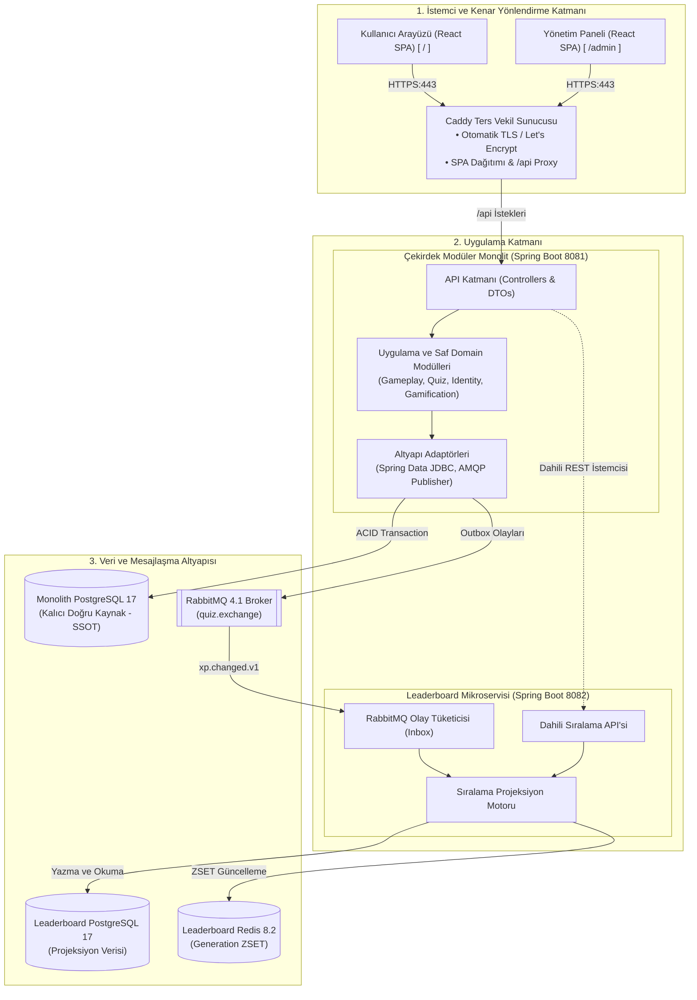
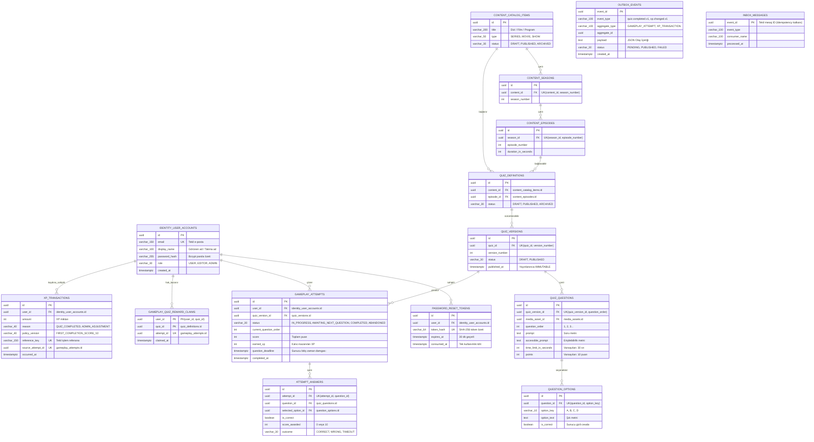
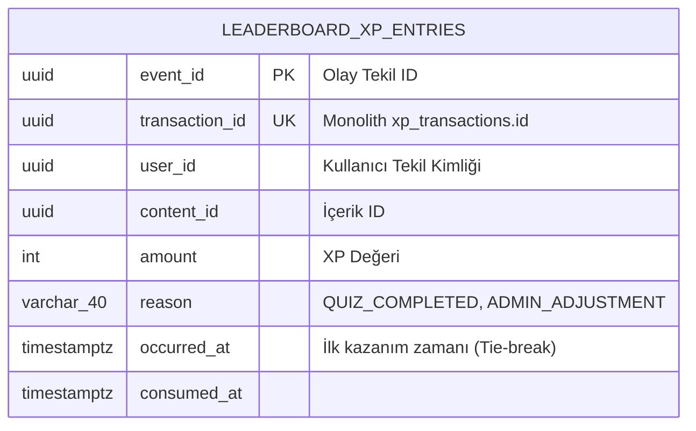
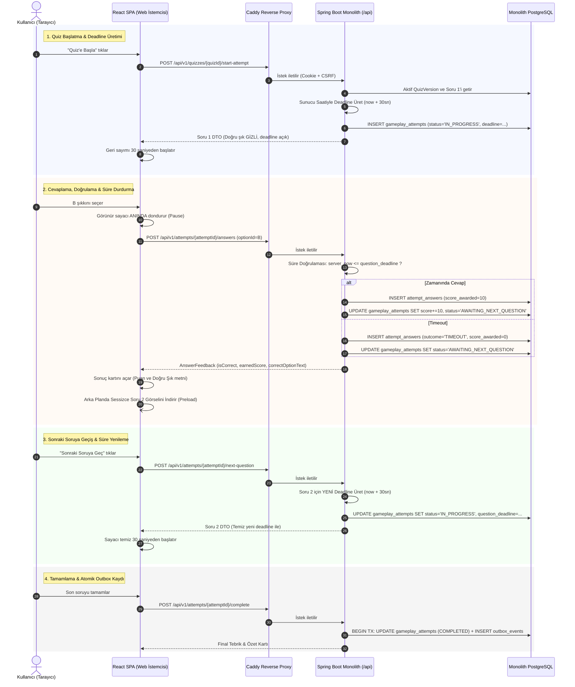
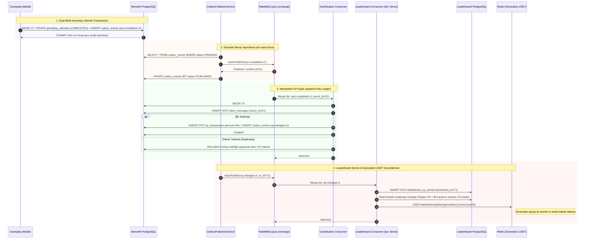
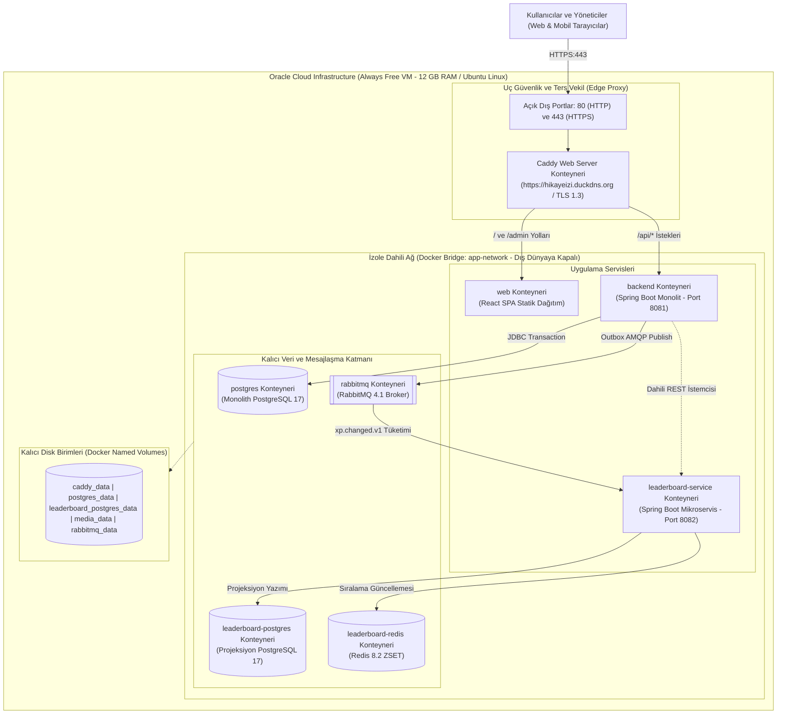

# TRT tabii İçerikleri İçin Etkileşim Platformu

Engagement Platform for TRT tabii Contents

Yunus Emre Arı  
Bilgisayar Mühendisliği Bölümü, Kocaeli Üniversitesi, Kocaeli, Türkiye  
yunuseemreari@gmail.com  

Özetçe — Bu çalışma, TRT tabii dijital yayın platformundaki dizi, film ve program içeriklerinin pasif izleme deneyiminden çıkarılarak quiz ve oyunlaştırma yoluyla etkileşimli hale getirilmesini sağlayan, kurumsal ölçeklenebilirlikte ve API-first bir backend platformunun mimari tasarımını, gerçeklenmesini ve canlı dağıtımını sunmaktadır. Geleneksel istemci odaklı quiz sistemlerindeki doğru cevap sızıntıları, süre manipülasyonları, ağ kesintilerinde çift işlem riskleri ve yüksek trafikte sıralama sorgularının getirdiği darboğazlar; sunucu otoriter oyun motoru, transactional outbox/inbox desenli asenkron mesajlaşma ve generation tabanlı Redis önbellek modeliyle çözülmüştür. Çekirdek sistem, dağıtık transaction karmaşasından kaçınmak amacıyla Clean Architecture prensipleriyle modüler monolit olarak tasarlanmış; okuma-yoğun sıralama yükü ise bağımsız ölçeklenebilen bir Spring Boot mikroservisine ayrıştırılmıştır. Geliştirilen sistem Oracle Cloud Infrastructure üzerinde Caddy ters vekiliyle sekiz izole Docker konteyneri halinde canlıya alınmış; 130 backend, 47 frontend ve gerçek Testcontainers senaryolarıyla doğrulanmıştır.

Anahtar Kelimeler — TRT tabii, oyunlaştırma, modüler monolit, sunucu otoriter, transactional outbox, idempotency, Spring Boot, RabbitMQ, Redis, PostgreSQL.

Abstract — This paper presents the architectural design, implementation, and live deployment of an enterprise-grade, API-first backend platform that transforms the passive viewing experience of TRT tabii video streaming content into an interactive engagement through quizzes and gamification. Traditional client-centric quiz applications suffer from answer leakage, client-side timer manipulation, race conditions causing duplicate XP rewards, and severe database bottlenecks during real-time leaderboard aggregations. These challenges are resolved by introducing a server-authoritative gameplay engine, asynchronous event-driven messaging powered by the Transactional Outbox/Inbox pattern, and a generation-based Redis caching model. The core system is structured as a Modular Monolith adhering to Clean Architecture principles to eliminate distributed transaction overheads, while the read-heavy leaderboard projection is decoupled into an independently scalable Spring Boot microservice. The resulting platform has been deployed to Oracle Cloud Infrastructure utilizing an 8-container topology behind a Caddy reverse proxy and verified with 130 backend, 47 frontend, and containerized integration test suites.

Keywords — TRT tabii, gamification, modular monolith, server-authoritative, transactional outbox, idempotency, Spring Boot, RabbitMQ, Redis, PostgreSQL.

# I. GİRİŞ

Dijital yayın platformlarının yaygınlaşmasıyla birlikte kullanıcıların video içeriklerini tüketim biçimi büyük ölçüde tek yönlü ve pasif bir izleme deneyimine dönüşmüştür. TRT tabii ekosisteminde yer alan zengin dizi, film, belgesel ve çocuk programı katalogları; kullanıcı bağlılığını, içerik hatırlanırlığını ve topluluk etkileşimini artıracak modern bir oyunlaştırma katmanına ihtiyaç duymaktadır. Bu çalışmanın temel amacı; TRT tabii izleyicilerine bölüm ve içerik bazlı yarışma deneyimi sunan, güvenilir, ölçeklenebilir ve kötüye kullanıma karşı korumalı bir backend altyapısı geliştirmektir. Projede quiz ve puanlama mekanizmasının seçilme nedeni; izleyicinin izlediği yapımla doğrudan zihinsel bağ kurmasını sağlamak, içerik tüketimini pekiştirmek ve adil bir rekabet ortamı oluşturmaktır.

Sistemin hedef kullanıcı kitlesi; TRT tabii izleyicileri, içerik ve soru editörleri, operasyon ve yönetim ekipleri ile gelecekte sisteme entegre edilecek web, mobil ve Smart TV istemcileridir. Çalışmanın kapsamı, tek ve dikey bir MVP akışı üzerine kurgulanmıştır. Bu akış; içeriği yayınlama, quiz başlatma, cevaplama, tamamlama, XP verme ve sıralama adımlarından oluşmaktadır.

Çalışma kapsamında geliştirilen sistemin sunduğu temel teknik katkılar şu şekildedir: İlk olarak, süre ve puanlama yetkisi tamamen sunucu saatine bağlanarak istemci tarafındaki manipülasyonlar engellenmiştir. İkinci olarak, yayınlanan quiz sürümleri değişmez kılınmış ve geçmiş denemelerin veri bütünlüğü güvenceye alınmıştır. Üçüncü olarak, ağ kesintilerinde oluşabilecek mükerrer tamamlama isteklerine karşı veritabanı kısıtlamaları ve append-only işlem defteriyle tekil XP kazanımı garanti edilmiştir. Dördüncü olarak, ilişkisel veritabanı ile mesaj brokerı arasındaki dual-write problemi Transactional Outbox ve Inbox desenleriyle çözülmüştür. Beşinci olarak, PostgreSQL sistemin tek kalıcı doğru kaynağı olarak konumlandırılırken, Redis kaybedilebilir ve yeniden üretilebilir bir okuma modeli olarak kullanılmıştır. Altıncı olarak, çekirdek sistem modüler monolit sınırlarıyla korunurken yalnız okuma-yoğun sıralama bileşeni bağımsız bir mikroservise ayrıştırılmıştır. Son olarak, WCAG 2.2 AA standartlarına uyumlu erişilebilir medya ve süre sözleşmesi sisteme kazandırılmıştır.

# II. SİSTEM GEREKSİNİMLERİ VE TASARIM HEDEFLERİ

## A. Fonksiyonel Gereksinimler
Platformun fonksiyonel gereksinimleri içerik kataloğu, quiz yazarlık, oynanış, ödül mekanizması, sıralama ve kullanıcı yönetimi olmak üzere altı ana başlıkta toplanmıştır. Sistem; içerik, sezon ve bölüm hiyerarşisinin taslak, yayında ve arşiv durumlarıyla yönetilmesini sağlar. Editörler soru metni, dört seçenek, erişilebilirlik açıklaması, kapak veya soru görseli ve süre tanımlayarak quiz sürümleri oluşturabilir ve yayınlayabilir. Kullanıcılar yayınlanmış sürüm üzerinden oturum başlatıp soruları süre kısıtında cevaplar; doğru şık bilgisi ancak cevap kaydedildikten sonra geri bildirim olarak sunulur. Başarıyla tamamlanan denemeler sonucunda kullanıcıya puanına uygun XP tanımlanır ve kullanıcının global ile içerik bazlı sıralamaları hesaplanır.

## B. Fonksiyonel Olmayan Gereksinimler
Sistem; veri bütünlüğü, güvenlik, idempotency, erişilebilirlik, gözlemlenebilirlik, hata toleransı ve test edilebilirlik hedefleri doğrultusunda tasarlanmıştır. Veritabanı seviyesinde tekillik, yabancı anahtar ve kontrol kısıtlamaları uygulanmıştır. Oturum güvenliğinde HttpOnly, Secure ve SameSite niteliklerine sahip çerezler ile SPA CSRF doğrulaması kullanılmıştır. Ağ tekrarlarında sistemin ikinci kez yan etki üretmemesi sağlanmıştır. Görme engelli bireyler için doğru cevabı ifşa etmeyen metin alternatifleri sunulmuştur. Dağıtık sistem izlenebilirliği W3C Trace Context ve OpenTelemetry ile güvenceye alınmıştır.

## C. Temel Tasarım İlkeleri ve Kavramsal Çerçeve
Sistemin mimari kararları beş temel ilke üzerine inşa edilmiştir:

Kullanıcı hesapları, denemeler, cevaplar ve kazanılan puanlar güçlü tutarlılık gerektirdiğinden PostgreSQL sistemin tek kalıcı doğru kaynağıdır. Redis ise milyonlarca kullanıcı arasındaki sıralama hesaplarını O(log(N)) hızında sunan bir önbellek ve okuma modelidir. Redis verisi kaybedilebilir niteliktedir ve PostgreSQL'deki işlem kayıtlarından saniyeler içinde sıfırdan yeniden üretilebilir.

Uygulama kodundaki domain kuralları kullanıcıya anlamlı geri bildirimler vermek için gereklidir; ancak eşzamanlı yarış durumlarında veri bozulmasını engellemek için veritabanı kısıtlamaları son savunma hattı olarak zorunludur.

İstemci bileşenleri kullanıcı denetiminde olduğundan skor ve doğru cevap otoritesi olamaz. İstemci yalnızca bir gösterim ve komut iletim aracıdır; süre ve skor sunucu saatine göre sunucuda belirlenir.

RabbitMQ gibi mesaj kuyrukları ağ kesintilerinde aynı mesajı birden fazla kez iletebileceğinden, tüketici servislerde mükerrer işlemlerin önlenmesi adına idempotency kontrolleri ve Inbox tabloları zorunlu bir tasarım ilkesidir.

# III. SİSTEM MİMARİSİ

## A. Genel Mimari
Sistem üç ana düzlemden oluşmaktadır. İstemci katmanında React ve TypeScript ile geliştirilen kullanıcı ve yönetim arayüzleri, Caddy ters vekili arkasında tek bir alan adı altında sunulmaktadır. Uygulama katmanında Spring Boot ile geliştirilen çekirdek modüler monolit ile bağımsız çalışan Leaderboard mikroservisi yer almaktadır. Veri ve mesajlaşma katmanında ise PostgreSQL, RabbitMQ ve Redis altyapıları bulunmaktadır (bkz. Şekil 1).

Şekil 1. Sistem mimarisi ve modül sınırları.

## B. Modüler Monolit Yapısı
Çekirdek uygulama on mantıksal modüle ayrılmıştır. Identity modülü kullanıcı kaydı, parola özetleme ve şifre sıfırlama işlemlerini yürütür. Content modülü dizi, film, sezon ve bölüm kataloğunu yönetir. Media modülü görsel dosyaların depolanmasını ve SHA-256 bütünlük kontrolünü sağlar. Quiz modülü soruların, seçeneklerin ve sürümlerin yaşam döngüsünden sorumludur. Gameplay modülü attempt başlatma, deadline üretimi, cevap doğrulama ve skorlamayı yönetir. Gamification modülü append-only XP işlem defterini tutar. Messaging modülü Transactional Outbox ve Inbox altyapısını işletir. Leaderboard modülü dış mikroservis ile entegrasyonu sağlar. Admin modülü yönetim yetkilerini koordine ederken, shared modülü ortak hata ve izleme yapılarını barındırır. Modüller birbirlerinin tablolarına doğrudan erişemez; iletişim yalnızca servis arayüzleri ve sözleşmeler üzerinden yürütülür.

## C. Katmanlar ve Bağımlılık Yönü
Uygulama Clean Architecture prensiplerine uygun olarak katmanlandırılmıştır. Domain katmanı saf iş kurallarından ve varlıklardan oluşur; sıfır framework bağımlılığı taşır. Application katmanı kullanım senaryolarını yürütür ve veritabanı transaction sınırlarını belirler. API katmanı HTTP isteklerini karşılar, DTO dönüşümlerini ve güvenlik kontrollerini yapar. Ports ve Infrastructure katmanları ise veritabanı sorguları, mesajlaşma ve e-posta adaptörlerini barındırır.

## D. Leaderboard Servisinin Ayrıştırılması
Sistemin tamamını ilk günden mikroservislere bölmek dağıtık transaction karmaşası ve ağ gecikmesi getireceğinden çekirdek domain monolit içinde tutulmuştur. Sıralama sorguları yoğun aggregation gerektiren ve okuma-yoğun bir karaktere sahip olduğu için yalnızca Leaderboard bileşeni ayrı bir Spring Boot servisine taşınmıştır. XP kazanımının asıl sahibi monolit olarak kalmış; Leaderboard servisi bu verinin bir projeksiyonu olarak kurgulanmıştır. Dış API monolit üzerinde sabit tutulmuş, özellik bayrağı ile mikroservise yönlendirilmiş ve olası bir arızada monolit içi eski yerel sorgu bir rollback yolu olarak korunmuştur.

# IV. DOMAIN VE VERİTABANI TASARIMI

## A. İçerik ve Quiz Sürümleme
İçerik kataloğu content_catalog_items, content_seasons ve content_episodes hiyerarşisinde yapılandırılmıştır. Quiz yapısında tanım ile sürüm kavramları birbirinden ayrılmıştır. Bir quiz sürümü yayınlandığı anda tamamen değişmez kabul edilir. Editör soruları değiştirmek istediğinde yayındaki sürüm güncellenmez; otomatik olarak yeni bir sürüm numarasıyla taslak sürüm oluşturulur. Bu sayede geçmiş kullanıcı denemelerinin veri bütünlüğü korunur.

## B. Gameplay ve Attempt Yaşam Döngüsü
Kullanıcı denemeleri katı bir durum makinesi ile yönetilir. Başlatılan deneme IN_PROGRESS durumuna geçer ve sunucu saatiyle 30 saniyelik deadline tanımlanır. Kullanıcı cevap verdiğinde veya süre dolduğunda deneme AWAITING_NEXT_QUESTION durumuna alınır ve sayaç dondurulur. Bu durumun amacı; kullanıcının sonuç kartını ve doğru şıkkı incelerken geçirdiği sürenin bir sonraki sorudan eksilmesini önlemektir. Kullanıcı sonraki soruya geçtiğinde sunucu saati baz alınarak sıfırdan 30 saniyelik yeni bir deadline üretilir ve deneme yeniden IN_PROGRESS olur. Tüm sorular bittiğinde deneme COMPLETED durumuna geçer.

## C. XP İşlem Defteri
xp_transactions tablosu append-only bir muhasebe defteri mantığıyla çalışır; mevcut satırlar güncellenmez veya silinmez. Bir kullanıcı bir quizi ilk kez tamamladığında skoruna karşılık gelen XP deftere işlenir ve gameplay_quiz_reward_claims tablosuna tekil kayıt atılır. Kullanıcı aynı quizi tekrar çözdüğünde kazanılan XP sıfır olarak işlenir; önceki kalıcı kazanım muhafaza edilir. İlk tamamlamasında sıfır puan alan kullanıcı için de sıfır değerli bir defter kaydı tutularak ödül hakkının kullanıldığı belgelenir. Yönetici düzeltmeleri ise eski kaydı değiştirmeden yeni bir satır eklenerek gerçekleştirilir.

## D. Veri Bütünlüğü Kuralları
İş kuralları veritabanı seviyesinde katı kısıtlamalarla garanti altına alınmıştır. attempt_answers tablosundaki tekil kısıt ile aynı soruya birden fazla cevap verilmesi engellenir. gameplay_quiz_reward_claims tablosundaki birincil anahtar ile mükerrer XP ödülü önlenir. quiz_versions tablosundaki tekil kısıt ile aynı quiz için sürüm çakışması engellenir. inbox_messages tablosundaki birincil anahtar ile mesajların birden fazla kez işlenmesi önlenir.

## E. Veritabanı Diyagramı
Veritabanı modeli iki şema halinde yapılandırılmıştır. Monolit şeması kimlik, içerik, quiz sürümleri, gameplay denemeleri, ödül kilitleri, XP defteri ve mesajlaşma tablolarını içerir (bkz. Şekil 2-a). Leaderboard şeması ise tekil transaction kısıtlamasına sahip sıralama projeksiyon tablosunu barındırır (bkz. Şekil 2-b).

Şekil 2-a. Monolit çekirdek veritabanı varlık-ilişki modeli.

Şekil 2-b. Leaderboard servisi projeksiyon şeması ve veri sahipliği.

# V. KRİTİK SİSTEM AKIŞLARI

## A. Quiz Başlatma ve Cevaplama Akışı
Quiz başlatma isteği geldiğinde aktif sürümün ilk sorusu çekilir, sunucu saatiyle 30 saniyelik deadline hesaplanır ve deneme oluşturulur. İstemciye dönen soru modelinde doğru şık bilgisi gizlidir. Kullanıcı şıkkı seçtiğinde arayüz sayacı durdurur ve isteği iletir. Sunucu süreyi doğrular, puanı hesaplar ve cevabı kaydeder. Doğru şıkkın metni ancak bu aşamada geri bildirim olarak iletilir. Kullanıcı sonuç kartını incelerken arayüz sıradaki sorunun görselini arka planda indirir. Kullanıcı sonraki soru butonuna bastığında sunucu temiz bir deadline üretir ve akış devam eder (bkz. Şekil 3).

Şekil 3. Sunucu otoriteli quiz ve gameplay sıralama diyagramı.

## B. Transactional Outbox ve XP Akışı
Quiz tamamlandığında attempt durumunun güncellenmesi ile tamamlanma olayının oluşturulması aynı yerel veritabanı transaction'ı içinde atomik olarak gerçekleştirilir. Böylece ağ kesintilerinde dahi veri kaybı önlenir. Arka plan yayıncı servisi bekleyen olayları toplu olarak çeker, RabbitMQ kuyruğuna iletir ve onay aldıktan sonra durumu günceller. Tüketici servis mesajı aldığında Inbox tablosunu kontrol eder; ilk kez gelen olay için XP defterine kayıt atar ve yeni bir XP değişim olayını Outbox'a bırakır. Tekrar iletilen mesajlar Inbox kalkanı sayesinde yok sayılır (bkz. Şekil 4).

Şekil 4. Transactional Outbox/Inbox ve olay akışı.

## C. Leaderboard Akışı
Leaderboard servisi XP değişim olayını tüketir ve kendi PostgreSQL projeksiyonuna yazar. Servis, toplam XP ve ilk kazanım zaman damgası kurallarıyla deterministik sıralamayı hesaplar. Sıralama Redis üzerinde generation tabanlı anahtarlar ile atomik olarak güncellenir. Redis'in devre dışı kalması durumunda sistem otomatik olarak PostgreSQL projeksiyon sorgularına geri düşer.

# VI. GÜVENLİK, ERİŞİLEBİLİRLİK VE DAYANIKLILIK

## A. Kimlik Doğrulama ve Yetkilendirme
Kullanıcı parolaları tek yönlü Bcrypt algoritması ile tuzlanarak özetlenir. XSS risklerini bertaraf etmek amacıyla HttpOnly, Secure ve SameSite niteliklerine sahip sunucu oturum çerezleri kullanılmıştır. Durum değiştiren tüm HTTP isteklerine karşı SPA CSRF doğrulaması zorunlu tutulmuştur. Sistemde kullanıcı, editör ve yönetici rolleri tanımlanmıştır; tüm yetki kontrolleri sunucu API katmanında icra edilir. Şifre sıfırlama akışında rastgele üretilen 256-bit token'ın veritabanında yalnızca SHA-256 özeti saklanır; token 30 dakika geçerlidir ve tek kullanımlıktır.

## B. Quiz Güvenliği
Doğru cevap bilgisi soru çözülmeden önce istemciye asla iletilmez. Süre ve puan hesaplamaları sunucu saatine bağlıdır; istemci tarafındaki saat değişiklikleri geçersizdir. Kullanıcılar yalnızca kendi oturumlarına ait denemeler üzerinde işlem yapabilir. Parola, ham token, doğru cevap ve kişisel veriler sistem loglarına yazılmaz.

## C. Erişilebilirlik
Sorularda kullanılan görseller için bilgilendirici veya dekoratif ayrımı yapılmıştır. Görme engelli bireyler için sunulan alternatif metinler doğru cevabı sızdırmadan görsel bağlamı aktarır. Sonuç ekranlarında renklerin yanı sıra metin etiketleri ve ikonlar kullanılmıştır. Kullanıcıdan sağlık veya engel raporu talep edilmeksizin genel bir erişilebilirlik tercihi olarak ek süre tanımlanabilmektedir.

## D. Kesinti Senaryoları ve Dayanıklılık
RabbitMQ kesintisinde monolit attempt tamamlama işlemlerini veritabanında sürdürür; olaylar Outbox tablosunda birikir ve broker açıldığında iletilir. Redis kesintisinde liderlik tablosu doğrudan PostgreSQL projeksiyon sorgularına yönlenir. Leaderboard servisi kapandığında ise çekirdek quiz ve XP akışı kesintisiz devam eder.

# VII. UYGULAMA VE CANLI DAĞITIM

## A. Kullanılan Teknolojiler
Sistem Java 21 ve Spring Boot 4.1 üzerinde geliştirilmiştir. Veri yönetiminde PostgreSQL 17 ve Flyway kullanılmıştır. Asenkron mesajlaşma RabbitMQ 4.1 ile, hızlı sıralama okuma modeli Redis 8.2 ile sağlanmıştır. İstemci tarafında React 19, TypeScript ve Vite tercih edilmiştir. Test aşamasında Testcontainers kullanılırken, canlı ortamda Caddy 2 ters vekili devreye alınmıştır.

## B. Production Topolojisi
Sistem Oracle Cloud Always Free sanal sunucusu üzerinde sekiz izole Docker konteyneri halinde canlıya alınmıştır (bkz. Şekil 5). İnternete yalnızca Port 80 ve Port 443 açılmıştır. Veritabanları, mesaj brokerı ve servisler dış dünyaya kapalı bir dahili köprü ağı üzerinden haberleşir. Tüm veriler Docker Named Volume disklerinde saklanır.

Şekil 5. Canlı dağıtım ve ağ topolojisi.

## C. Operasyonel Özellikler
Caddy sunucusu SSL sertifikalarını Let's Encrypt üzerinden otomatik üretir ve yeniler. Spring Boot Actuator sağlık kontrolleriyle veritabanı ve disk durumu izlenir. Medya varlıkları için uzun süreli önbellekleme başlıkları tanımlanmıştır.

# VIII. TEST VE DOĞRULAMA

## A. Test Stratejisi
Sistem test piramidi ilkelerine göre doğrulanmıştır. Birim testlerle saf domain kuralları, Testcontainers entegrasyon testleriyle gerçek PostgreSQL, RabbitMQ ve Redis davranışları, ArchUnit ile mimari modül sınırları test edilmiştir.

## B. İş Kuralı ve Test Kanıtı Eşleştirmesi

TABLO I. İŞ KURALI VE TEST KANITI EŞLEŞTİRMESİ

| Korunan Risk / İş Kuralı | Uygulanan Mekanizma | Doğrulayan Test Kanıtı |
| :--- | :--- | :--- |
| Aynı soruya ikinci cevap | Unique kısıtı ve domain kontrolü | GameplayIntegrationTest duplicate cevap testi |
| İkinci tamamlama ile mükerrer XP | Reward claim ve defter tekilliği | GamificationIdempotencyTest tekil XP testi |
| Doğru cevabın soru öncesi sızması | DTO'dan doğru şıkkın çıkarılması | QuizAuthoringIntegrationTest gizlilik testi |
| Sonuç kartında süre kaybı | Awaiting next question durumu | GameplayIntegrationTest sayaç durdurma testi |
| RabbitMQ tekrarında çift XP | Inbox tablosu tekil event ID | MessagingIntegrationTest mükerrer olay testi |
| Leaderboard duplicate XP olayı | Transaction ID tekil kısıtı | LeaderboardServiceIntegrationTest idempotency testi |
| CSRF saldırısı ve sahte istek | Cookie ve double submit header | CsrfProtectionIntegrationTest CSRF testi |
| İlk admin hesabının tekliği | Bootstrap tekil kontrolü | InitialAdminBootstrapIntegrationTest admin testi |
| Şifre sıfırlama token güvenliği | SHA-256 özeti ve tek kullanım | AccountAuthenticationIntegrationTest token testi |

## C. Doğrulama Sonuçları
Yerel Maven derlemesinde monolit paketinde 130, Leaderboard servisinde 4 test başarıyla tamamlanmıştır. Frontend paketinde 11 dosyada 47 Vitest testi ve TypeScript strict derlemesi doğrulanmıştır. Oracle Cloud sunucusu üzerinde HTTPS kullanıcı arayüzü, yönetim paneli ve API erişimleri canlı ortamda test edilmiştir.

## D. Sınırlar ve Kapasite Notu
Yapılan yerel yük profilleri ve tek sunuculu Compose dağıtımı sistemin mimari tutarlılığını kanıtlar; ancak bu durum çok bölgeli kurumsal üretim kapasitesi garantisi yerine geçmez.

# IX. KARŞILAŞILAN SORUNLAR VE MÜHENDİSLİK ÇÖZÜMLERİ

## A. PostgreSQL ve RabbitMQ Dual-Write Problemi
Attempt tamamlandığında veritabanı güncellenip RabbitMQ'ya mesaj gönderilirken ağ kesilirse veritabanında tamamlanan işlem için XP olayı iletilemiyordu. Bu sorun Transactional Outbox deseniyle çözüldü; attempt durumu ile olay kaydı aynı yerel transaction'da atomik olarak commit edildi ve arka plan servisiyle kuyruğa taşındı. Dağıtık XA transaction'ları yüksek gecikme sebebiyle elendi. Çözüm TransactionalOutboxIntegrationTest ile kanıtlandı.

## B. AWAITING_NEXT_QUESTION Durumu ve Sütun Uzunluğu Sınırı
Sonuç ekranında süreyi korumak için eklenen AWAITING_NEXT_QUESTION durumu kaydedilirken veritabanı hata verdi. Kök nedenin eski migration'daki VARCHAR(20) sınırı olduğu tespit edildi. V18 migration dosyası ile sütun uzunluğu VARCHAR(30) yapıldı. Durum adını kısaltmak yerine domain dilinin netliğini korumak tercih edildi. Çözüm GameplayIntegrationTest ile doğrulandı.

## C. Sonuç Ekranında Sonraki Soru Süresinin Erimesi
Kullanıcı bir soruyu cevapladıktan sonra sonuç kartını incelerken geçen sürenin sonraki sorunun 30 saniyelik hakkından eksildiği görüldü. Cevap verildiği anda aktif deadline silinip attempt AWAITING_NEXT_QUESTION durumuna geçirildi. Kullanıcı sonraki soru butonuna bastığında çağrılan uç nokta üzerinden sunucu saatiyle sıfırdan 30 saniyelik yeni bir deadline üretildi. Çözüm GameplayIntegrationTest ile korundu.

## D. Tekrar Çözümde Quiz Kartında Kazanılan XP'nin Sıfır Görünmesi
Bir quizi ilk çözüşünde 40 XP kazanan kullanıcının, aynı quizi ikinci kez çözdüğünde ana sayfadaki kartta sıfır XP gördüğü tespit edildi. Kök nedenin arayüzün son denemenin anlık kazanımını okuması olduğu anlaşıldı. İlgili sorgu kullanıcının o quizdeki tüm tamamlanmış denemeleri arasından kalıcı en yüksek XP değerini getirecek şekilde güncellendi. Çözüm GameplayIntegrationTest ile kanıtlandı.

## E. Canlı Ağ Ortamında Soru Görselinin Gecikmeli Yüklenmesi
Canlı ortamda sonraki soruya geçildiğinde soru metninin anında geldiği ancak görselin gecikmeli yüklendiği gözlendi. Medya uç noktasına immutable önbellekleme başlıkları tanımlandı; arayüz tarafında ise kullanıcı sonuç kartını incelerken bir sonraki sorunun görselini arka planda indiren preloading mekanizması uygulandı. Çözüm MediaControllerIntegrationTest ile doğrulandı.

# X. TARTIŞMA VE TRADE-OFF DEĞERLENDİRMESİ

Modüler monolit seçimi geliştirme hızını artırmış ve transaction yönetimini kolaylaştırmıştır; buna karşılık bağımsız bileşen dağıtımı esnekliği sınırlandırılmıştır.

Leaderboard servisinin ayrılması monolit üzerindeki okuma yükünü sıfırlamıştır; ancak XP kazanımı ile sıralamanın güncellenmesi arasında milisaniyelik bir gecikme kabul edilmiştir.

Oracle Cloud sanal sunucusunda tek Compose kümesi kurulum maliyetini sıfıra indirmiştir; fakat sunucu arızasında sistemin durması bilinçli bir MVP ödünleşimidir.

Redis kullanımı sıralama sorgularını hızlandırmıştır; ancak Redis'in kalıcı olmaması nedeniyle generation tabanlı senkronizasyon maliyeti üstlenilmiştir.

HttpOnly çerez oturumu XSS saldırılarına karşı üstün güvenlik sağlamıştır; ancak çoklu sunucu instance'larına geçildiğinde merkezi bir oturum deposu gereksinimi doğacaktır.

# XI. SONUÇ VE GELECEK ÇALIŞMALAR

## A. Elde Edilen Sonuçlar
TRT tabii içerikleri için tasarlanan etkileşim platformu; yayınlama, başlatma, cevaplama, tamamlama, XP kazanımı ve sıralama akışını başarıyla tamamlamıştır. Sistem; sunucu otoriter oyun motoru, transactional mesajlaşma, değişmez sürümleme ve canlı dağıtımıyla hedeflenen kurumsal yetkinliğe ulaşmıştır.

## B. Bilinen Sınırlamalar
Kurumsal merkezi OIDC sözleşmesi henüz entegre edilmemiştir. Tek sunucu dağıtımı yüksek erişilebilirlik kümesine sahip değildir. Çok editörlü taslak düzenlemeleri için optimistic locking henüz eklenmemiştir. KVKK veri silme ve yasal saklama süreleri operasyonu tamamlanmamıştır.

## C. Gelecek Çalışmalar
Gelecekte TRT tabii canlı yayın akışıyla senkronize yarışma modülünün eklenmesi, WebSocket tabanlı çok oyunculu düello altyapısının kurulması, merkezi OIDC kimlik entegrasyonu ve Kubernetes üzerinde yatay ölçekleme altyapısına geçilmesi planlanmaktadır.

# BİLGİLENDİRME

Bu çalışma, TRT bünyesinde gerçekleştirilen staj programı kapsamında, tabii platformunun etkileşimli geleceğine yönelik kurumsal backend mimarilerini ve modern yazılım mühendisliği pratiklerini araştırmak ve uygulamak amacıyla geliştirilmiştir. Süreç boyunca teknik rehberlik sağlayan TRT mühendislik ekiplerine teşekkür ederiz.

# KAYNAKLAR

[1] Spring Boot Documentation Team, "Spring Boot Reference Documentation (v4.1.0)," VMware Tanzu, 2026.  
[2] PostgreSQL Global Development Group, "PostgreSQL 17.5 Documentation: Concurrency Control and Transaction Isolation," 2025.  
[3] C. Richardson, Microservices Patterns: With examples in Java, Manning Publications, 2018.  
[4] RabbitMQ Core Team, "Reliable Delivery and Publisher Confirms in RabbitMQ," Broadcom, 2025.  
[5] Redis Documentation, "Redis Sorted Sets and Rank Aggregation Mechanics," Redis Ltd., 2025.  
[6] R. C. Martin, Clean Architecture: A Craftsman's Guide to Software Structure and Design, Prentice Hall, 2017.  
[7] World Wide Web Consortium (W3C), "Web Content Accessibility Guidelines (WCAG) 2.2," W3C Recommendation, 2023.  
[8] OpenTelemetry Authors, "W3C Trace Context Specification and Distributed Tracing," Cloud Native Computing Foundation, 2024.  
[9] E. Evans, Domain-Driven Design: Tackling Complexity in the Heart of Software, Addison-Wesley, 2003.  
[10] Internet Engineering Task Force (IETF), "HTTP State Management Mechanism (Cookies) and SameSite Attribute," RFC 6265bis, 2024.  
