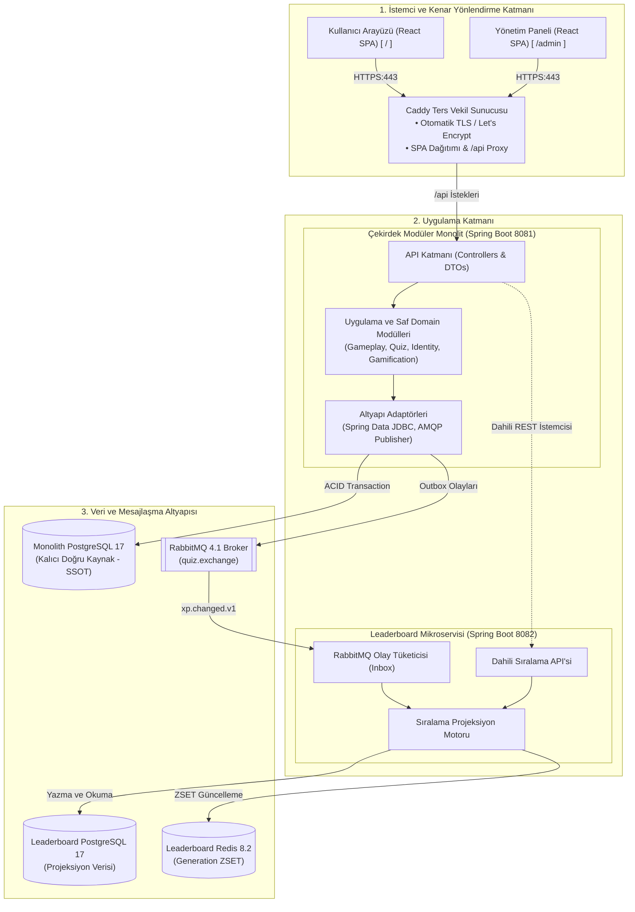

# 01 - Sistem Mimarisi ve Modül Sınırları (Şekil 1)

Bu diyagram, **TRT tabii İçerik Etkileşim Platformu**'nun genel bileşen mimarisini, Clean Architecture katman sınırlarını, modüler monolit yapısını ve bağımsız **Leaderboard** mikroservisi ile olan ilişkisini kesişmeyen, temiz ve dikey hiyerarşik bir geometride gösterir.

---

## 🏛️ Şekil 1. Sistem Mimarisi ve Modül Sınırları (Mermaid Architecture Diagram)

---

## 📌 Mimari Açıklamalar

1. **Katmanlı Hiyerarşi (Top-Down):** İstekler en üstteki Caddy ters vekilinden girer, monolit API katmanına akar ve sırasıyla domain ile altyapı adaptörlerine iner.
2. **Çekirdek - Mikroservis Ayrımı:** Monolit ve Leaderboard mikroservisi yan yana konumlandırılmış; aralarındaki tek yönlü asenkron iletişim ortadaki RabbitMQ brokerı üzerinden kurulmuştur.
3. **Veri İzolasyonu:** Monolit doğrudan kendi PostgreSQL'ine, Leaderboard servisi ise kendi PostgreSQL ve Redis kaynaklarına erişir; veritabanı seviyesinde çapraz erişim kesinlikle engellenmiştir.
