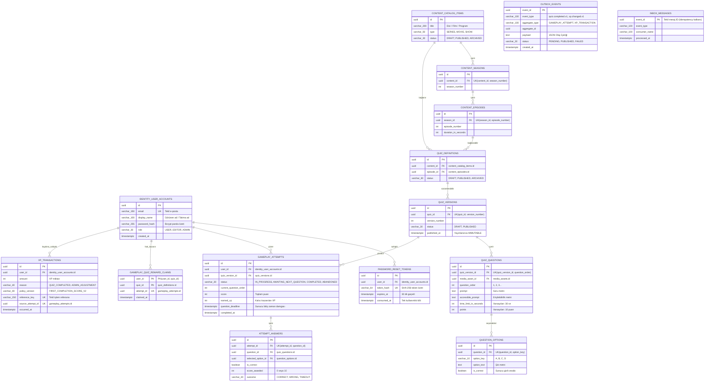
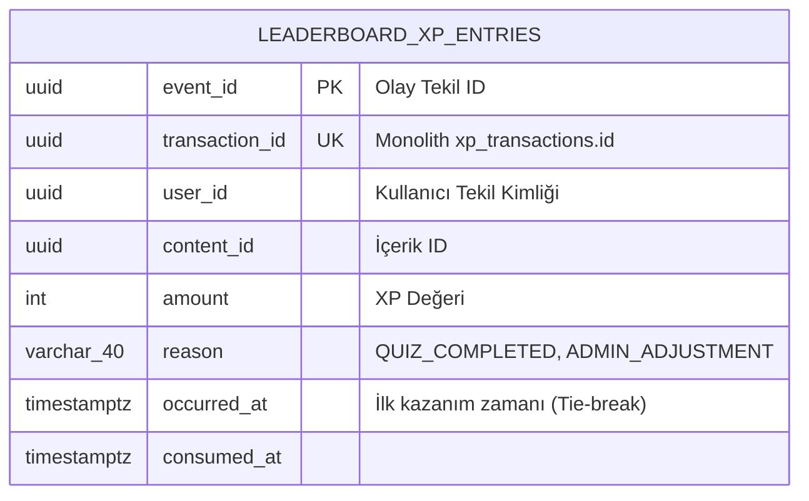

# 02 - Veritabanı Şeması ve ERD Modelleri (Şekil 2-a ve Şekil 2-b)

Bu doküman, **TRT tabii İçerik Etkileşim Platformu**'nun gerçek Flyway migration dosyalarıyla (`V1` - `V18`) ve kod tabanıyla %100 birebir örtüşen ilişkisel veritabanı şemasını iki parça halinde sunar.

---

## 🗄️ Şekil 2-a. Monolit Çekirdek Veritabanı Varlık-İlişki Modeli (Mermaid ERD)

---

## 🗄️ Şekil 2-b. Leaderboard Servisi PostgreSQL Projeksiyonu ve Veri Sahipliği

---

## 🛡️ Kritik Veri Bütünlüğü Kısıtlamaları (Constraints)

1. **`gameplay_quiz_reward_claims (PK: user_id, quiz_id)`:** Kullanıcının o quizden ilk tamamlama ödülünü yalnızca bir kez almasını garanti eder (ADR-0026).
2. **`attempt_answers (UK: attempt_id, question_id)`:** Aynı soruya yarış durumunda (race condition) ikinci bir cevabın kaydedilmesini veritabanı seviyesinde imkansız kılar.
3. **`xp_transactions (UK: reference_key, UK: source_attempt_id)`:** Append-only defterde aynı denemeden kaynaklanan mükerrer XP kaydı oluşmasını engeller.
4. **`leaderboard_xp_entries (UK: transaction_id)`:** RabbitMQ at-least-once tekrar iletiminde liderlik tablosu mikroservisinde çift kayıt oluşmasını önler.
