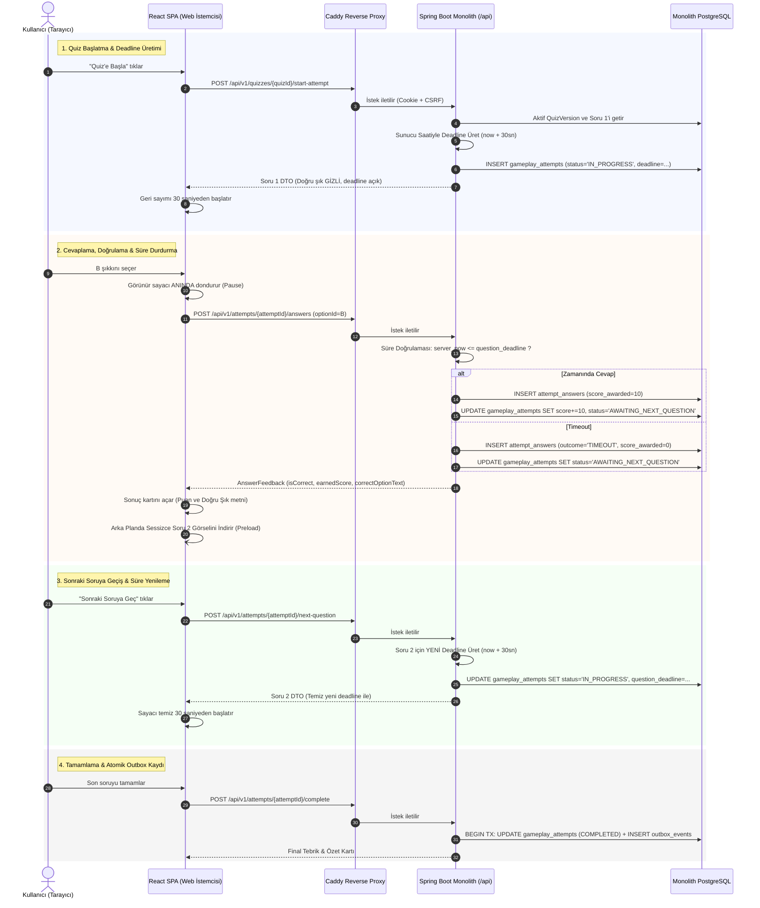

# 03 - Quiz ve Gameplay İş Akışı (Şekil 3)

Bu diyagram, **TRT tabii İçerik Etkileşim Platformu**'ndaki sunucu otoriter (Server-Authoritative) puanlama mekanizmasını, süre/deadline üretimini, `AWAITING_NEXT_QUESTION` durum geçişini ve görsel önyükleme (image preloading) sürecini gösterir.

---

## ⏱️ Şekil 3. Sunucu Otoriteli Quiz ve Gameplay Sıralama Diyagramı (Mermaid Sequence)

---

## 🎯 Temel Kazanımlar

- **`AWAITING_NEXT_QUESTION` Durumu:** Kullanıcı sonuç ekranında cevabı incelerken geçen süre sonraki sorudan çalınmaz; yeni soruya geçişte sunucu sıfırdan temiz 30 saniyelik deadline üretir.
- **Doğru Cevabın Gizliliği:** Doğru şık bilgisi (`correctOptionText`), soru çözülene kadar istemciye kesinlikle iletilmez.
- **Görsel Önyükleme (Preload):** Ağ gecikmesini önlemek için sonuç ekranı incelenirken sıradaki görsel arka planda indirilir.
