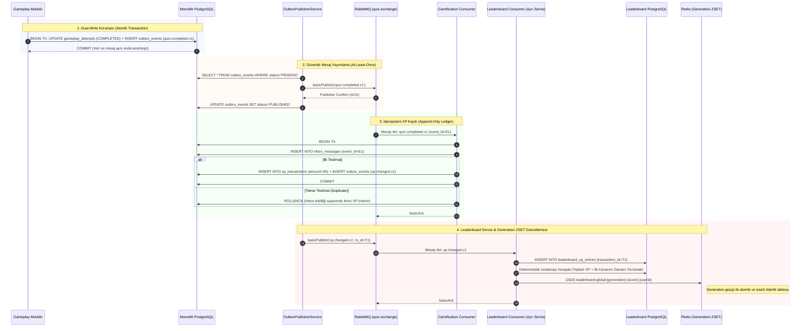

# 04 - Olay Güdümlü Mesajlaşma ve Outbox/Inbox Akışı (Şekil 4)

Bu diyagram, **TRT tabii İçerik Etkileşim Platformu**'ndaki **Transactional Outbox & Inbox** deseni, **RabbitMQ** asenkron olay dağıtımı, `xp_transactions` defteri ve **Redis Generation Tabanlı Sıralama** akışını gösterir.

---

## 📬 Şekil 4. Transactional Outbox/Inbox ve Olay Akışı (Mermaid Sequence)

---

## 🔑 Çözülen Temel Problemler

1. **Dual-Write Probleminin Ortadan Kaldırılması:** İş verisi ve Outbox mesajı aynı SQL transaction'ında commit edildiği için ağ veya broker çökse bile hiçbir olay kaybolmaz.
2. **At-Least-Once Mesaj Teslimatında Idempotency:** Tüketici servislerdeki `inbox_messages` ve `transaction_id` tekillikleri mükerrer işlem yapılmasını %100 engeller.
3. **Redis Generation Modeli:** Redis sıralaması generation bazlı (`leaderboard:global:{gen}`) güncellenerek okuma esnasında yarış durumları ve eksik veri aktarımı engellenir.
