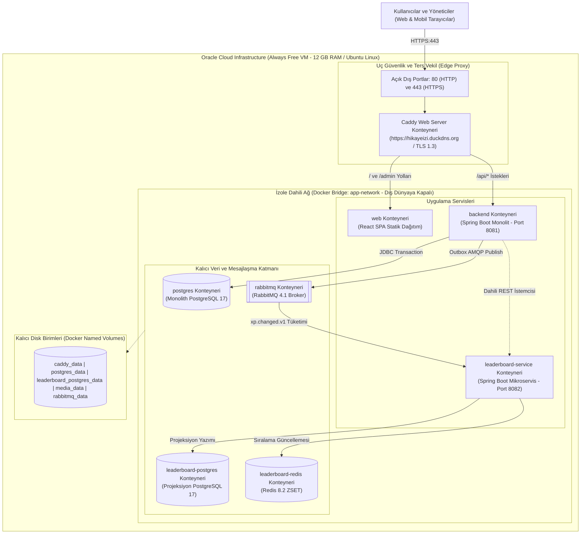

# 05 - Canlı Dağıtım, Ağ ve Konteyner Topolojisi (Şekil 5)

Bu diyagram, **TRT tabii İçerik Etkileşim Platformu**'nun **Oracle Cloud Free Tier VM** üzerindeki 8 izole Docker konteynerini, Caddy SSL/TLS ters vekilini ve ağ güvenlik sınırlarını kesişmeyen, net ve anlaşılır bir hiyerarşik düzende gösterir.

---

## 🌐 Şekil 5. Canlı Dağıtım ve Ağ Topolojisi (Mermaid Deployment Diagram)

---

## 🔒 Güvenlik ve Ağ Mimarisi Özeti

1. **Sıfır Güven (Zero-Trust) Port İzolasyonu:** İnternete yalnızca Port 80 ve Port 443 açıktır. Veritabanları (`postgres`, `leaderboard-postgres`), kuyruk (`rabbitmq`) ve önbellek (`leaderboard-redis`) dış dünyaya tamamen kapalı olup yalnızca `app-network` içinde haberleşir.
2. **Kesişmeyen Dikey Akış:** İstekler Caddy'den uygulama servislerine (`AppTier`), oradan da kendi ilgili veritabanı veya mesajlaşma konteynerine (`DataTier`) doğrudan ve paralel bir geometride akar.
3. **Kalıcı Disk Güvencesi:** Konteynerler yeniden başlatılsa dahi tüm ilişkisel veriler, medya yüklemeleri ve SSL sertifikaları alttaki `StorageTier` Named Volume birimlerinde güvende kalır.
